# Introdução

Informações básicas do projeto.

* **Projeto:** Estagi.ON
* **Repositório GitHub:** https://github.com/ICEI-PUC-Minas-PMGES-TI/pmg-es-2026-1-ti1-0427200-estagi-on.git
* **Membros da equipe:**

* Gustavo Albuquerque Lourenço Mattos de Castro 
* Arthur Moraes Braga Araujo
* Enzo Fernandes Alcantra
* Juan Pedro Marques Faria
* Arthur Gabriel de Oliveira Fonseca Santos
* Pedro Arthur de Sena Ribeiro

A documentação do projeto é estruturada da seguinte forma:

1. Introdução
2. Contexto
3. Product Discovery
4. Product Design
5. Metodologia
6. Solução
7. Referências Bibliográficas

✅ [Documentação de Design Thinking (MIRO)](files/Miro.pdf)

# Contexto

Estudantes universitários enfrentam dificuldades para encontrar vagas de estágio compatíveis com sua área, devido à dispersão de oportunidades em diferentes plataformas e a dificuldade de encontrar empresas realmente empenhadas em auxiliar a formação do universitário no mercado de trabalho. Do mesmo modo,empresas têm dificuldade em identificar candidatos adequados, enfrentando processos de divulgação limitados e triagem ineficiente.
A aplicação será feita por meio de um aplicativo que intermediará o estagiário e a empresa.

## Problema

O problema central identificado está na ineficiência da conexão entre estudantes universitários e empresas no processo de estágio. Atualmente, as oportunidades estão dispersas em diversas plataformas, dificultando a busca por vagas alinhadas à área de formação dos estudantes. Além disso, muitas empresas enfrentam limitações na divulgação e na triagem de candidatos, o que compromete a identificação de perfis adequados. Como consequência, há um desalinhamento entre oferta e demanda, tornando o processo de recrutamento lento, pouco eficiente e insatisfatório para ambas as partes.


## Objetivos

Objetivo do projeto:
O objetivo geral deste trabalho é desenvolver um software capaz de melhorar a conexão entre estudantes universitários e empresas, buscando reduzir as dificuldades encontradas na busca e oferta de vagas de estágio.

Objetivos específicos:
Analisar as principais dificuldades enfrentadas por estudantes e empresas no processo de recrutamento de estagiários;
Investigar como as plataformas digitais atuais lidam com a divulgação e seleção de vagas de estágio;
Propor uma solução que otimize a correspondência entre perfis de candidatos e requisitos das empresas;
Avaliar como a tecnologia pode tornar o processo de busca e seleção mais eficiente e acessível.

## Justificativa

A motivação para desenvolver esta aplicação está na importância dos estágios para a formação acadêmica e profissional dos estudantes, além das dificuldades enfrentadas na busca por oportunidades adequadas
Os objetivos específicos foram definidos com foco em compreender as principais falhas no processo atual de recrutamento e identificar formas de melhorar a correspondência entre candidatos e vagas, o aprofundamento nesses aspectos permite propor uma solução mais eficiente e alinhada às necessidades reais dos usuários.

## Público-Alvo

Os principais usuários são estudantes universitários e empresas. Os estudantes, em geral, possuem familiaridade no uso de aplicativos, redes sociais e plataformas online, buscam a praticidade, rapidez e clareza nas informações sobre vagas, além de uma experiência simples de candidatura.
Já as empresas, representadas principalmente por profissionais de recursos humanos ou gestores, possuem maior experiência com processos seletivos e utilizam sistemas digitais para divulgação de vagas e triagem de candidatos, esses usuários demandam ferramentas que facilitem a organização, filtragem e análise de perfis.

# Product Discovery

## Etapa de Entendimento

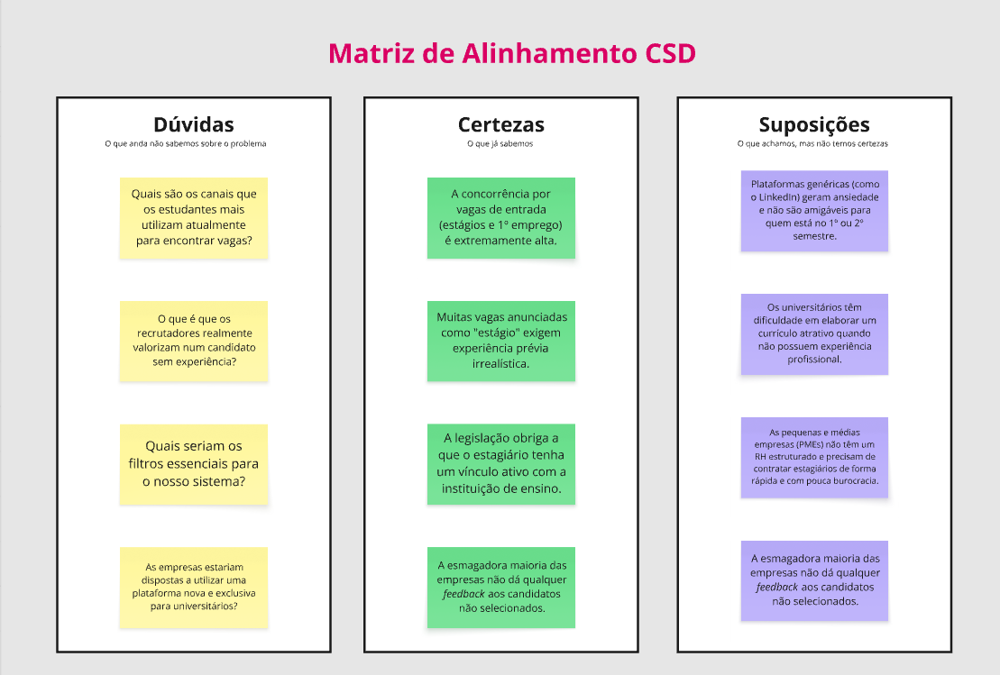


1. Mapa de Stakeholders
  O mapa organiza os envolvidos no ecossistema do projeto em três níveis de proximidade e influência:
  Pessoas Fundamentais (Centro): São os usuários diretos e principais afetados pelo problema. No mapa, este grupo é composto por estudantes universitários e o empregador.
  Pessoas Importantes (Círculo Intermediário): São entidades que facilitam ou dificultam a viabilidade da solução. Estão listados: faculdade, empresas e cursos.
  Pessoas Influenciadoras (Círculo Externo): São órgãos ou contextos que devem ser consultados por questões regulatórias ou de mercado. Inclui: ministério do trabalho, opiniões públicas, indicação (networking) e rede social de vagas.

2. Matriz de Alinhamento CSD
Certezas (O que já sabemos)
  A concorrência para vagas de entrada é extremamente alta.
  Existem vagas de estágio que exigem experiência prévia irrealista.
  A legislação exige vínculo ativo entre estagiário e instituição de ensino.
  A maioria das empresas não fornece feedback aos candidatos reprovados.
Suposições (O que achamos, mas não temos certeza)
  Plataformas genéricas (como LinkedIn) geram ansiedade em alunos do início do curso.
  Universitários têm dificuldade em criar currículos sem ter experiência profissional.
  Pequenas e médias empresas (PMEs) precisam de processos de contratação rápidos e menos burocráticos.
  Reforça-se a ideia de que a maioria das empresas não dá feedback.
Dúvidas (O que ainda não sabemos)
  Quais canais os estudantes mais usam para buscar vagas hoje?
  O que os recrutadores realmente valorizam em quem não tem experiência?
  Quais seriam os filtros essenciais para o sistema?
  As empresas estariam dispostas a migrar para uma plataforma nova e exclusiva para universitários?
## Etapa de Definição

### Personas


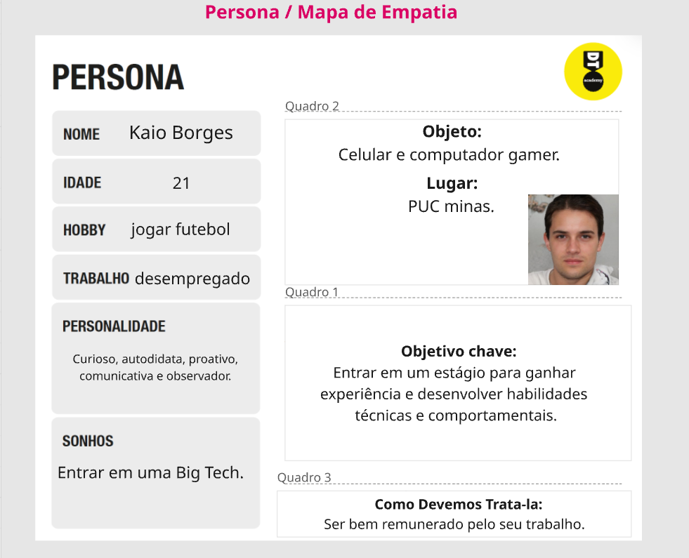
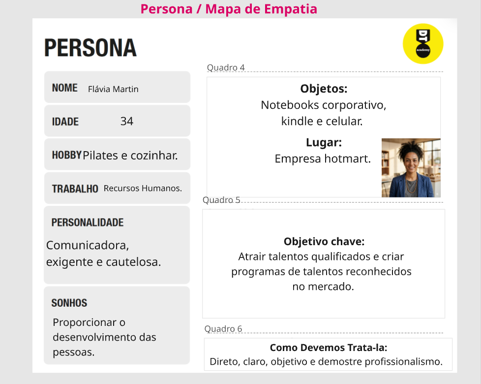
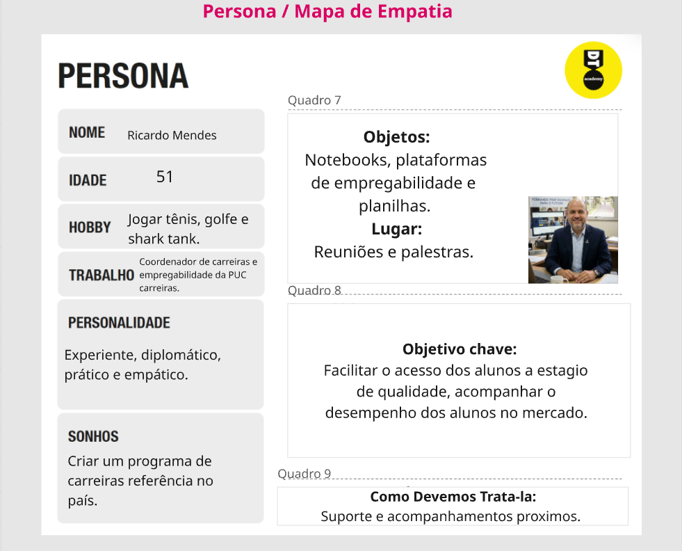

PERSONA 1: 
Kaio Borges, 21 anos, é um estudante universitário que atualmente se encontra desempregado e busca sua primeira oportunidade de estágio. Possui perfil curioso, autodidata e proativo, além de boa comunicação e interesse em desenvolvimento pessoal e profissional.

Seu principal objetivo é ingressar no mercado de trabalho por meio de um estágio que lhe permita adquirir experiência prática e desenvolver habilidades técnicas e comportamentais. No entanto, enfrenta dificuldades devido à exigência de experiência prévia e à dispersão das vagas em diferentes plataformas, o que torna o processo de busca confuso e ineficiente.

PERSONA 2: 
Flávia Martin, 34 anos, atua na área de Recursos Humanos e é responsável por processos de recrutamento e seleção em sua empresa. Possui perfil comunicador, exigente e cauteloso, prezando por eficiência e qualidade na contratação de novos talentos.

Seu principal objetivo é atrair candidatos qualificados e estruturar programas de estágio que contribuam para o crescimento da empresa. Entretanto, enfrenta dificuldades relacionadas ao alto volume de currículos desalinhados com as vagas e à ineficiência dos métodos tradicionais de triagem.

PERSONA 3: 
Ricardo Mendes, 51 anos, é coordenador de carreiras e empregabilidade, com vasta experiência no acompanhamento de estudantes em sua inserção no mercado de trabalho. Possui perfil diplomático, empático e orientado a resultados.

Seu principal objetivo é facilitar o acesso dos alunos a oportunidades de estágio de qualidade, além de acompanhar seu desenvolvimento profissional. Contudo, enfrenta desafios relacionados à falta de integração entre instituições de ensino e empresas, bem como à dificuldade de monitorar o progresso dos estudantes.

# Product Design

Nesse momento, vamos transformar os insights e validações obtidos em soluções tangíveis e utilizáveis. Essa fase envolve a definição de uma proposta de valor, detalhando a prioridade de cada ideia e a consequente criação de wireframes, mockups e protótipos de alta fidelidade, que detalham a interface e a experiência do usuário.

## Histórias de Usuários

Com base na análise das personas foram identificadas as seguintes histórias de usuários:

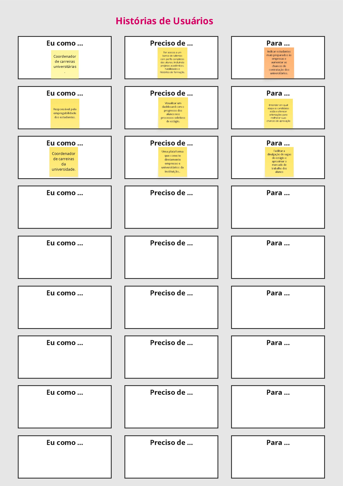

1. Perfil de Coordenação
Eu como: Coordenador de carreiras universitárias.
Preciso de: Ter acesso a um banco de talentos com perfis completos dos alunos, incluindo projetos acadêmicos, habilidades e histórico de formação.
Para: Indicar estudantes mais preparados às empresas e aumentar as chances de contratação dos universitários.

2. Perfil de Empregabilidade
Eu como: Responsável pela empregabilidade dos estudantes.
Preciso de: Visualizar um dashboard com o progresso dos alunos nos processos seletivos de estágio.
Para: Entender em qual etapa os candidatos estão e oferecer orientações para melhorar suas chances de aprovação.

3. Perfil de Integração Institucional
Eu como: Coordenador de carreiras da universidade.
Preciso de: Uma plataforma que conecte diretamente empresas e universitários da instituição.
Para: Facilitar a divulgação de vagas de estágio e aproximar o mercado de trabalho dos alunos.

## Proposta de Valor

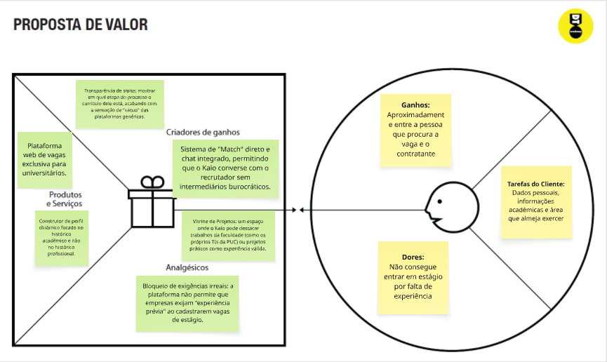
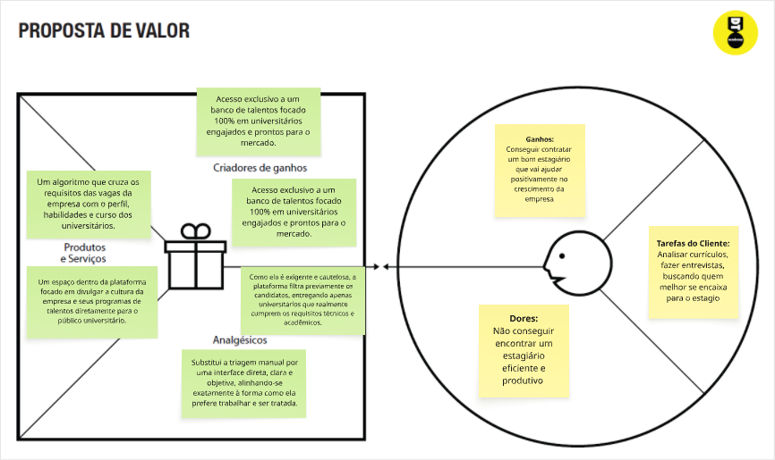
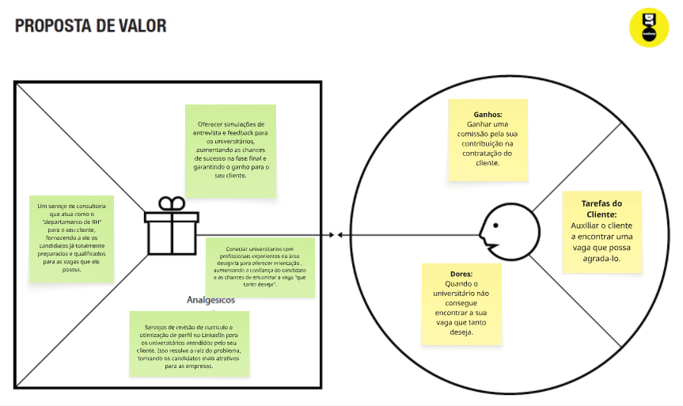

1. Kaio Borges (Estudante Universitário)

A proposta de valor para Kaio Borges consiste em oferecer uma plataforma centralizada e intuitiva que simplifique a busca por estágios, eliminando a dispersão de vagas em múltiplos canais. O sistema utiliza mecanismos inteligentes de correspondência entre o perfil do estudante e os requisitos das vagas, aumentando significativamente suas chances de aprovação, mesmo sem experiência prévia. Além disso, proporciona maior transparência no processo seletivo, comunicação direta com recrutadores e um espaço para exposição de projetos acadêmicos, permitindo que o estudante demonstre seu potencial além do currículo tradicional.

2. Flávia Martin (Recrutadora / Empresa)

Para Flávia Martin, a proposta de valor está na otimização do processo de recrutamento por meio de uma plataforma que automatiza a triagem de candidatos e melhora a precisão na seleção de perfis compatíveis com as vagas. O sistema reduz o volume de currículos irrelevantes ao aplicar filtros inteligentes e cruzamento de dados, permitindo decisões mais rápidas e assertivas. Além disso, oferece acesso a um banco qualificado de estudantes, facilitando a construção de programas de estágio mais eficientes e alinhados às necessidades da empresa, reduzindo custos e tempo de contratação.

3. Ricardo Mendes (Coordenador Acadêmico)

A proposta de valor para Ricardo Mendes baseia-se na integração entre universidade, estudantes e empresas, proporcionando uma ferramenta que facilita o acompanhamento da empregabilidade dos alunos e o fortalecimento de programas de carreira. A plataforma permite monitorar o desempenho dos estudantes, identificar oportunidades alinhadas ao perfil acadêmico e ampliar a conexão com o mercado de trabalho. Dessa forma, contribui para aumentar a taxa de inserção profissional dos alunos e fortalecer a reputação da instituição como formadora de talentos qualificados.

## Requisitos

As tabelas que se seguem apresentam os requisitos funcionais e não funcionais que detalham o escopo do projeto.

### Requisitos Funcionais


### Requisitos não Funcionais


## Projeto de Interface

Artefatos relacionados com a interface e a interacão do usuário na proposta de solução.

### Wireframes

Estes são os protótipos de telas do sistema.

Login: A porta de entrada do sistema. Possui um espaço para o logotipo, um texto motivacional à esquerda e, à direita, os campos de entrada para E-mail e Senha, além de botões para "Entrar" e "Criar Conta".

Home: A página principal de navegação. Apresenta uma barra lateral (sidebar) com itens de menu, uma barra de busca ou filtro no topo e uma área central organizada em cards que parecem listar as vagas disponíveis ou candidaturas recentes.

Menu: Uma visão detalhada da navegação lateral. Contém seções como "Meu Perfil" e links rápidos para as funções principais do sistema, facilitando o acesso direto a diferentes módulos.

Perfil: Área dedicada às informações do usuário. Inclui um espaço para foto de perfil, dados de contato ("Info") e campos para edição de biografia ou competências, permitindo que o aluno mantenha seu currículo atualizado.

Calendário: Uma tela focada em organização temporal. Exibe uma visualização em grade (estilo mensal ou semanal) para que o usuário acompanhe datas importantes, como prazos de processos seletivos ou entrevistas agendadas.

Notícias: Um feed de atualizações. Organizado com uma área de destaque para a notícia principal e uma lista lateral ou inferior com tópicos relevantes sobre o mercado de trabalho e dicas de carreira.

Mensagens: O canal de comunicação direta. Possui uma lista de conversas à esquerda e a janela de chat à direita, permitindo que o estudante interaja com recrutadores ou coordenadores.

Dashboard: Uma central de controle visual. Focada em métricas e status, utiliza elementos gráficos e resumos para mostrar o progresso das candidaturas, visualizações de perfil e outras estatísticas relevantes para o usuário.

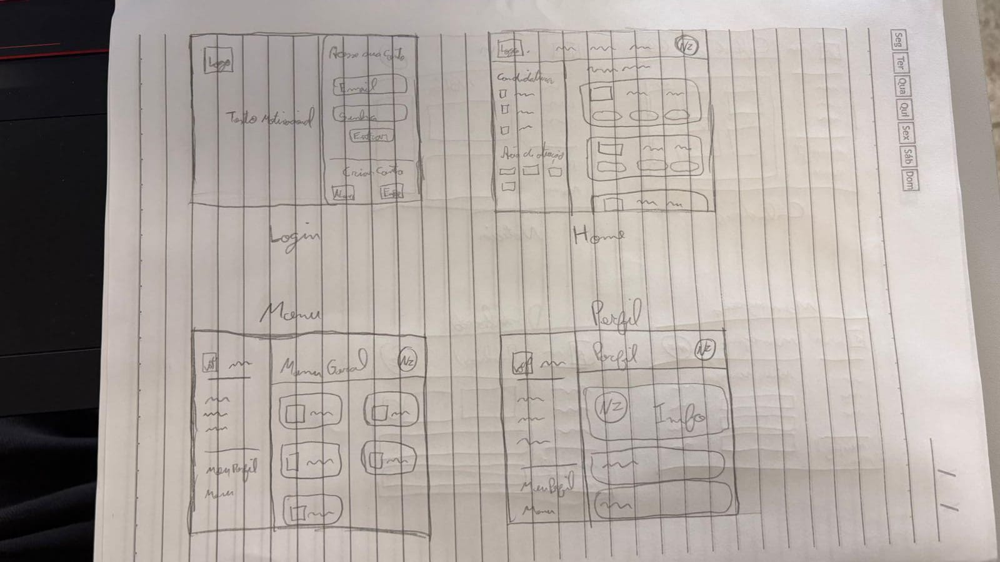
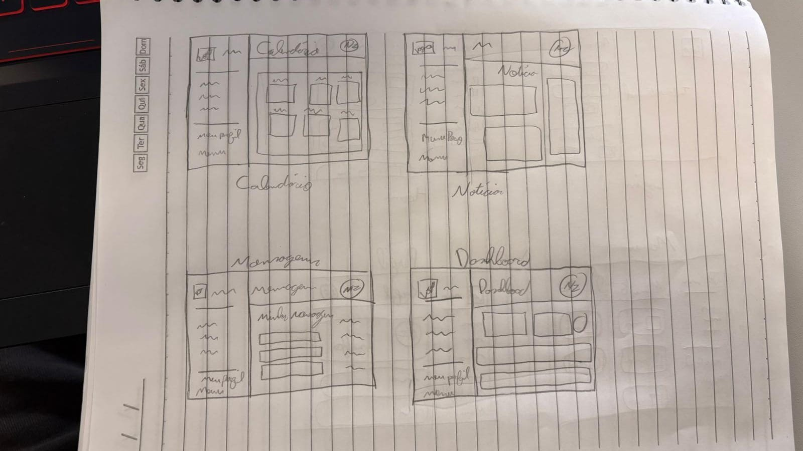


### User Flow


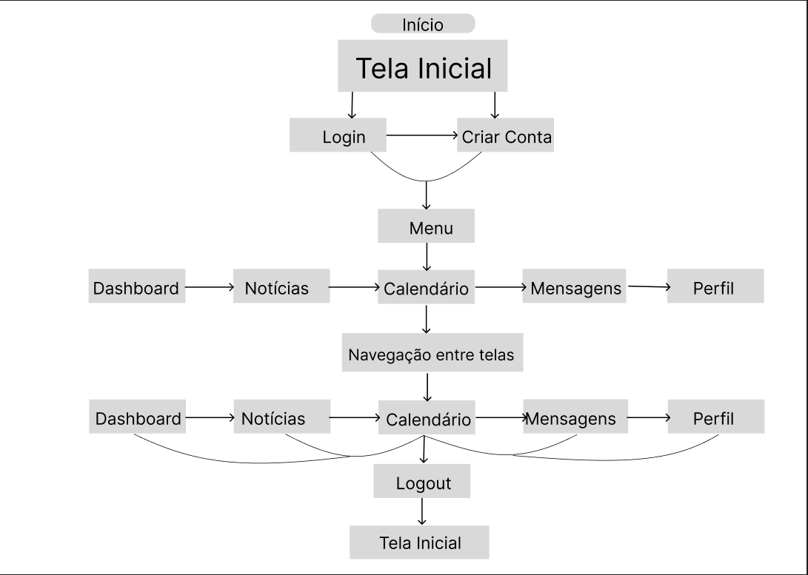

1. Acesso e Autenticação
  O usuário tem dois caminhos primários: realizar o Login (caso já possua cadastro) ou Criar Conta. Ambas as ações convergem para o Menu principal, que funciona como o hub central de acesso após a autenticação.

2. Navegação e Interação
  A partir do Menu, o usuário entra no ecossistema de funcionalidades da plataforma. O fluxo demonstra uma estrutura de Navegação entre telas altamente conectada, permitindo que o estudante transite livremente entre os módulos centrais:
  Dashboard: Para visão geral de progresso.
  Notícias: Para atualização de mercado.
  Calendário: Para gestão de prazos e entrevistas.
  Mensagens: Para comunicação.
  Perfil: Para gestão de dados pessoais e currículo.

3. Encerramento
  O fluxo é cíclico e seguro. Independente da tela em que o usuário esteja (Dashboard, Notícias, etc.), ele pode optar pelo Logout. Essa ação finaliza a sessão ativa e redireciona o usuário de volta à Tela Inicial, fechando o ciclo de uso da aplicação.

### Protótipo Interativo

[](https://www.figma.com/site/DKoE4yuXm3fAfH3mWurSu5/Untitled?node-id=0-1&t=s3GPR9D6ZUGPbqMK-1)  ⚠️ EXEMPLO ⚠️

# Metodologia

Detalhes sobre a organização do grupo e o ferramental empregado.

## Ferramentas

Relação de ferramentas empregadas pelo grupo durante o projeto.

Processo de Deisgn Thinking: https://miro.com/pt/
O Miro é uma plataforma de lousa virtual (whiteboard) que permite a colaboração em tempo real. No contexto do Design Thinking, ele funciona como o espaço central para o brainstorming e a estruturação de ideias.

Repositório de código: https://github.com/
O GitHub é uma plataforma de hospedagem de código-fonte que utiliza o sistema de controle de versões Git. Ele serve como o repositório oficial do projeto, onde os arquivos de HTML, CSS e Python ficam armazenados com segurança.

Protótipo Interativo: https://figma.com/
O Figma é uma ferramenta de design de interface (UI) e experiência do usuário (UX). Ele é utilizado para transformar aqueles esboços manuais (wireframes) em uma versão digital de alta fidelidade.

## Gerenciamento do Projeto

Divisão de papéis no grupo e apresentação da estrutura da ferramenta de controle de tarefas (Kanban).


> ⚠️ **APAGUE ESSA PARTE ANTES DE ENTREGAR SEU TRABALHO**
>
> Nesta parte do documento, você deve apresentar  o processo de trabalho baseado nas metodologias ágeis, a divisão de papéis e tarefas, as ferramentas empregadas e como foi realizada a gestão de configuração do projeto via GitHub.
>
> Coloque detalhes sobre o processo de Design Thinking e a implementação do Framework Scrum seguido pelo grupo. O grupo poderá fazer uso de ferramentas on-line para acompanhar o andamento do projeto, a execução das tarefas e o status de desenvolvimento da solução.
>
> **Orientações**:
>
> - [Sobre Projects - GitHub Docs](https://docs.github.com/pt/issues/planning-and-tracking-with-projects/learning-about-projects/about-projects)
> - [Gestão de projetos com GitHub | balta.io](https://balta.io/blog/gestao-de-projetos-com-github)
> - [(460) GitHub Projects - YouTube](https://www.youtube.com/playlist?list=PLiO7XHcmTsldZR93nkTFmmWbCEVF_8F5H)
> - [11 Passos Essenciais para Implantar Scrum no seu Projeto](https://mindmaster.com.br/scrum-11-passos/)
> - [Scrum em 9 minutos](https://www.youtube.com/watch?v=XfvQWnRgxG0)

# Solução Implementada

Esta seção apresenta todos os detalhes da solução criada no projeto.

## Vídeo do Projeto

O vídeo a seguir traz uma apresentação do problema que a equipe está tratando e a proposta de solução. ⚠️ EXEMPLO ⚠️

[](https://www.youtube.com/embed/70gGoFyGeqQ)

> ⚠️ **APAGUE ESSA PARTE ANTES DE ENTREGAR SEU TRABALHO**
>
> O video de apresentação é voltado para que o público externo possa conhecer a solução. O formato é livre, sendo importante que seja apresentado o problema e a solução numa linguagem descomplicada e direta.
>
> Inclua um link para o vídeo do projeto.

## Funcionalidades

Esta seção apresenta as funcionalidades da solução.Info

##### Funcionalidade 1 - Cadastro de Contatos ⚠️ EXEMPLO ⚠️

Permite a inclusão, leitura, alteração e exclusão de contatos para o sistema

* **Estrutura de dados:** [Contatos](#ti_ed_contatos)
* **Instruções de acesso:**
  * Abra o site e efetue o login
  * Acesse o menu principal e escolha a opção Cadastros
  * Em seguida, escolha a opção Contatos
* **Tela da funcionalidade**:


> ⚠️ **APAGUE ESSA PARTE ANTES DE ENTREGAR SEU TRABALHO**
>
> Apresente cada uma das funcionalidades que a aplicação fornece tanto para os usuários quanto aos administradores da solução.
>
> Inclua, para cada funcionalidade, itens como: (1) titulos e descrição da funcionalidade; (2) Estrutura de dados associada; (3) o detalhe sobre as instruções de acesso e uso.

## Estruturas de Dados

Descrição das estruturas de dados utilizadas na solução com exemplos no formato JSON.Info

##### Estrutura de Dados - Contatos   ⚠️ EXEMPLO ⚠️

Contatos da aplicação

```json
  {
    "id": 1,
    "nome": "Leanne Graham",
    "cidade": "Belo Horizonte",
    "categoria": "amigos",
    "email": "Sincere@april.biz",
    "telefone": "1-770-736-8031",
    "website": "hildegard.org"
  }
  
```

##### Estrutura de Dados - Usuários  ⚠️ EXEMPLO ⚠️

Registro dos usuários do sistema utilizados para login e para o perfil do sistema

```json
  {
    id: "eed55b91-45be-4f2c-81bc-7686135503f9",
    email: "admin@abc.com",
    id: "eed55b91-45be-4f2c-81bc-7686135503f9",
    login: "admin",
    nome: "Administrador do Sistema",
    senha: "123"
  }
```

> ⚠️ **APAGUE ESSA PARTE ANTES DE ENTREGAR SEU TRABALHO**
>
> Apresente as estruturas de dados utilizadas na solução tanto para dados utilizados na essência da aplicação quanto outras estruturas que foram criadas para algum tipo de configuração
>
> Nomeie a estrutura, coloque uma descrição sucinta e apresente um exemplo em formato JSON.
>
> **Orientações:**
>
> * [JSON Introduction](https://www.w3schools.com/js/js_json_intro.asp)
> * [Trabalhando com JSON - Aprendendo desenvolvimento web | MDN](https://developer.mozilla.org/pt-BR/docs/Learn/JavaScript/Objects/JSON)

## Módulos e APIs

Esta seção apresenta os módulos e APIs utilizados na solução

**Images**:

* Unsplash - [https://unsplash.com/](https://unsplash.com/) ⚠️ EXEMPLO ⚠️

**Fonts:**

* Icons Font Face - [https://fontawesome.com/](https://fontawesome.com/) ⚠️ EXEMPLO ⚠️

**Scripts:**

* jQuery - [http://www.jquery.com/](http://www.jquery.com/) ⚠️ EXEMPLO ⚠️
* Bootstrap 4 - [http://getbootstrap.com/](http://getbootstrap.com/) ⚠️ EXEMPLO ⚠️

> ⚠️ **APAGUE ESSA PARTE ANTES DE ENTREGAR SEU TRABALHO**
>
> Apresente os módulos e APIs utilizados no desenvolvimento da solução. Inclua itens como: (1) Frameworks, bibliotecas, módulos, etc. utilizados no desenvolvimento da solução; (2) APIs utilizadas para acesso a dados, serviços, etc.

# Referências

As referências utilizadas no trabalho foram:

Linkedin: [](https://www.linkedin.com/)
O LinkedIn é a rede social profissional mais popular do mundo, com diversos recursos para conectar trabalhadores que buscam emprego, a empresas que anunciam vagas.

